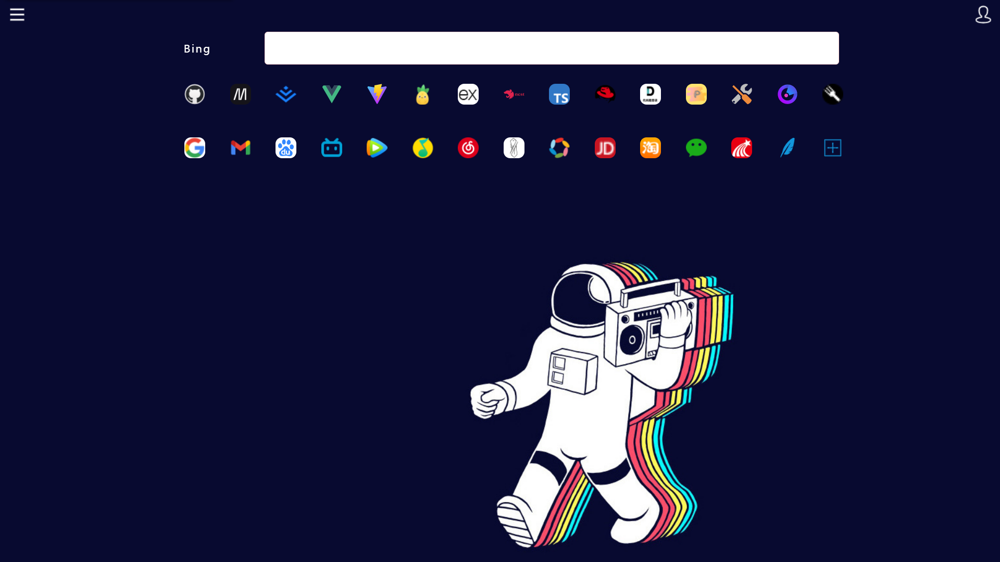
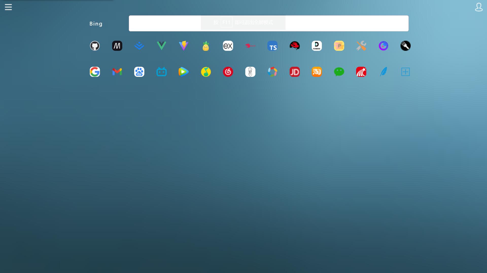
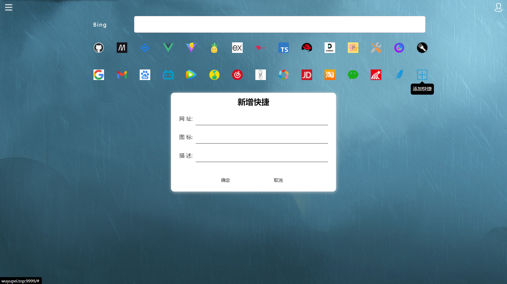
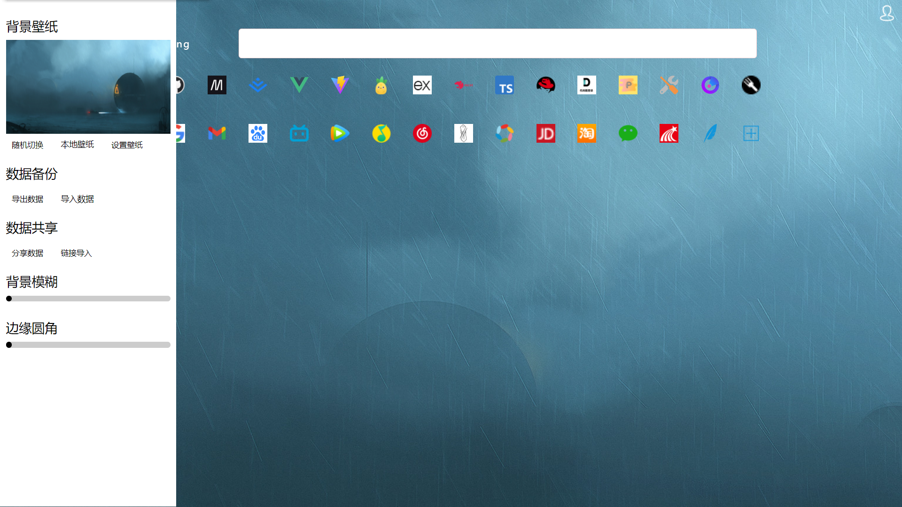
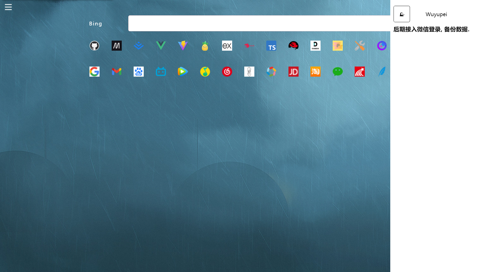

#### MyPage 浏览器主页

> 这两天开发了一个浏览器主页, 功能还在不断的完善,目前已经开发的差不多了

##### 先来看一下效果吧

还不错吧!嘿嘿

用起来还可以我现在已经习惯用了.

这是 github 地址:
前端: https://github.com/wu-yu-pei/my-page
后端: https://github.com/wu-yu-pei/my-page-server
