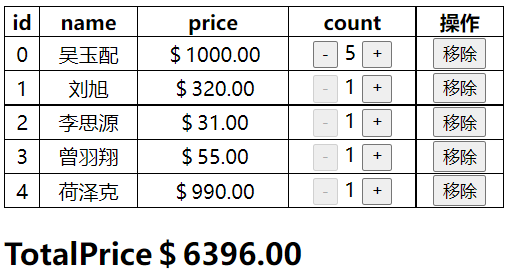

#### react 再学习第一天

##### jsx 基本练习

- 渲染电影列表

```js
class App extends React.Component {
  constructor() {
    super();
    this.state = {
      movice: ['aaa', 'bbb', 'ccc'],
    };
  }

  render() {
    return (
      <div>
        <h2>电影列表</h2>
        <ul>
          <li>{this.state.movice[0]}</li>
          <li>{this.state.movice[1]}</li>
          <li>{this.state.movice[2]}</li>
        </ul>

        <h2>电影列表</h2>
        <ul>
          {this.state.movice.map((item, index) => {
            return <li>{item}</li>;
          })}
        </ul>
      </div>
    );
  }
}

ReactDOM.render(<App />, document.getElementById('app'));
```

- 计数器案例

```js
class App extends React.Component {
  constructor() {
    super();
    this.state = {
      counter: 0,
    };
    this.add = this.add.bind(this);
    this.red = this.red.bind(this);
  }

  add() {
    this.setState({
      counter: this.state.counter + 1,
    });
    console.log('add');
  }

  red() {
    this.setState({
      counter: this.state.counter - 1,
    });
    console.log('red');
  }

  render() {
    return (
      <div>
        counter:{this.state.counter} <br />
        {/* this问题  */}
        <button onClick={this.add}>+</button>
        <button onClick={this.red}>-</button>
        <button onClick={this.add.bind(this)}>+</button>
        <button onClick={this.red.bind(this)}>-</button>
        <button onClick={() => this.add()}>+</button>
        <button onClick={() => this.red()}>-</button>
      </div>
    );
  }
}

ReactDOM.render(<App />, document.getElementById('app'));
```

- jsx 中的注释

```js
render() {
  return (
    <div>
      {/* 你好啊 阿斯蒂芬你好*/}
      <h2>哈哈</h2>
    </div>
  );
}
```

- jsx 中渲染数据

```js
render() {
  return (
    <div>
      {/*可以显示*/}
      <h2>{this.state.name}</h2>
      <h2>{this.state.age}</h2>
      <h2>{this.state.names}</h2>
      {/*不显示*/}
      <h2>{this.state.foo}</h2>
      <h2>{this.state.bar}</h2>
      <h2>{this.state.flag}</h2>
      {/*显示*/}
      <h2>{this.state.foo + ''}</h2>
      <h2>{this.state.bar + ''}</h2>
      <h2>{this.state.flag + ''}</h2>
      {/*不显示对象 直接报错*/}
      {/*<h2>{this.state.body}</h2>*/}
      <h2>{this.state.flag ? '登录成功' : ''}</h2>
      <h2>{this.state.firstName + this.state.lasename}</h2>
      <h2>{100 + 200}</h2>
      <h2>{this.getFullName()}</h2>
    </div>
  );
}
```

- jsx 绑定属性

```js
class App extends React.Component {
  constructor() {
    super();
    this.state = {
      src: 'http://wu-yu-pei.github.io/leetcode',
      imgsrc: 'https://wu-yu-pei.github.io/leetcode/src/imgs/55.jpg',
      flag: true,
    };
  }

  render() {
    return (
      <div>
        {/*绑定普通属性*/}
        <a href={this.state.src} id="a">
          a
        </a>
        
        {/* 绑定class*/}
        <p className="foo">class</p>
        <p className={'foo ' + (this.state.flag ? 'active' : '')}>class</p>
        {/*绑定style*/}
        <p style={{ color: '#ccc', fontSize: '30px' }}>style</p>
        <label htmlFor="a">aaa</label>
      </div>
    );
  }
}

ReactDOM.render(<App />, document.getElementById('app'));
```

- jsx 绑定事件传递参数

```js
class App extends React.Component {
  constructor() {
    super();
    this.state = {
      movice: ['a', 'b', 'c'],
    };
  }

  // handleClick(a, e) {
  //   console.log(a, e);
  //   console.log(2020);
  // }

  // handleClick = (e) => {
  //   console.log(2020, e);
  // };

  handleItemClick(e, item, index) {
    console.log(e, item, index);
  }

  render() {
    // return <h1 onClick={(e) => this.handleClick(10, e)}>Hello word!</h1>;
    // return <h1 onClick={this.handleClick}>Hello word!</h1>;

    return (
      <ul>
        {this.state.movice.map((item, index) => {
          return <li onClick={(e) => this.handleItemClick(e, item, index)}>{item}</li>;
        })}
      </ul>
    );
  }
}

ReactDOM.render(<App />, document.getElementById('app'));
```

- jsx 条件渲染

```js
class App extends React.Component {
  constructor() {
    super();
    this.state = {
      isLogin: true,
    };
  }

  // render() {
  //   let one = null;
  //   let two = null;
  //   if (this.state.isLogin) {
  //     one = '欢迎回来';
  //     two = '退出';
  //   } else {
  //     one = '请先登录';
  //     two = '登录';
  //   }
  //   return (
  //     <h1>
  //       {one} {two}
  //     </h1>
  //   );
  // }

  handleLogin() {
    this.setState({
      isLogin: !this.state.isLogin,
    });
  }

  render() {
    let { isLogin } = this.state;
    return (
      <div>
        <p>{isLogin ? '欢迎回来' : '请先登录'}</p>
        <p onClick={() => this.handleLogin()}>{isLogin ? '退出 ' : '登录'}</p>
        <h2>{isLogin ? '你好啊! coder' : null}</h2>
        {/* 逻辑与表达式的结果是: let res = true && "你好啊"; console.log(res) // '你好啊'  let res = true && '1010'; console.log(res) // '1010'*/}
        <h2>{isLogin && '你好啊'}</h2>
        {isLogin && <h2>你好啊</h2>}
      </div>
    );
  }
}

ReactDOM.render(<App />, document.getElementById('app'));
```

- jsx 模拟 vue--> v-show

```js
class App extends React.Component {
  constructor() {
    super();
    this.state = {
      isLogin: true,
    };
  }

  handleBtnClick = () => {
    this.setState({
      isLogin: !this.state.isLogin,
    });
  };

  render() {
    const { isLogin } = this.state;
    const isShow = isLogin ? 'block' : 'none';
    return (
      <div>
        <button onClick={this.handleBtnClick}>{isLogin ? '退出' : '登录'}</button>
        <p style={{ display: isShow }}>你好啊</p>
      </div>
    );
  }
}

ReactDOM.render(<App />, document.getElementById('app'));
```

- jsx 列表渲染

```js
class App extends React.Component {
  constructor() {
    super();
    this.state = {
      list: [100, 20, 55, 0, 33, 78, 10, 999, 100],
    };
  }

  render() {
    const { list } = this.state;
    return (
      <div>
        <ul>
          <h1>普通渲染</h1>
          {list.map((item) => (
            <li>{item}</li>
          ))}
        </ul>
        <ul>
          <h1>过滤渲染</h1>
          {list
            .filter((item) => item > 55)
            .map((item) => (
              <li>{item}</li>
            ))}
        </ul>

        <ul>
          <h1>截取渲染</h1>
          {list.splice(0, 3).map((item) => (
            <li>{item}</li>
          ))}
          {list.map((item) => (
            <li>{item}</li>
          ))}
        </ul>
      </div>
    );
  }
}

ReactDOM.render(<App />, document.getElementById('app'));
```

- jsx 综合案例

```css
table {
  width: 400px;
  border: 1px solid #000;
  border-collapse: collapse;
  text-align: center;
}
tr,
td,
th {
  border: 1px solid #000;
}

.count {
  margin: 0 5px;
}
```

```js
class App extends React.Component {
  constructor() {
    super();
    this.state = {
      books: [
        {
          name: '吴玉配',
          price: 1000,
          count: 1,
        },
        {
          name: '刘旭',
          price: 320,
          count: 1,
        },
        {
          name: '李思源',
          price: 31,
          count: 1,
        },
        {
          name: '曾羽翔',
          price: 55,
          count: 1,
        },
        {
          name: '荷泽克',
          price: 990,
          count: 1,
        },
      ],
    };
  }

  renderTable() {
    const { books } = this.state;
    return (
      <div>
        <table>
          <thead>
            <tr>
              <th>id</th>
              <th>name</th>
              <th>price</th>
              <th>count</th>
              <th>操作</th>
            </tr>
          </thead>
          <tbody>
            {books.map((item, index) => {
              return (
                <tr>
                  <td>{index}</td>
                  <td>{item.name}</td>
                  <td>{this.formatPrice(item.price)}</td>
                  <td>
                    <button
                      disabled={item.count <= 1 ? true : false}
                      onClick={() => this.handleBtnClick(index, -1)}
                    >
                      -
                    </button>
                    <span className="count">{item.count}</span>
                    <button onClick={() => this.handleBtnClick(index, 1)}>+</button>
                  </td>
                  <td>
                    <button onClick={() => this.handleRemove(index)}>移除</button>
                  </td>
                </tr>
              );
            })}
          </tbody>
        </table>
        <h2>TotalPrice{this.getTotalPrice()}</h2>
      </div>
    );
  }

  renderEmpty() {
    return <div>购物车为空!</div>;
  }
  render() {
    return this.state.books.length === 0 ? this.renderEmpty() : this.renderTable();
  }

  formatPrice(price) {
    return '＄' + price.toFixed(2);
  }

  getTotalPrice() {
    let result = this.state.books.reduce((pre, item) => pre + item.price * item.count, 0);
    return this.formatPrice(result);
  }

  handleBtnClick(index, i) {
    let newBooks = [...this.state.books];
    newBooks[index].count += i;
    this.setState({
      books: newBooks,
    });
  }

  handleRemove(index) {
    this.setState({
      books: this.state.books.filter((item, indey) => index != indey),
    });
  }
}

ReactDOM.render(<App />, document.getElementById('app'));
```

- 案例效果图

  
  
  

**总结**

> jsx 的本质: render 函数中 return 的结果() 就是 jsx 表达式 这个表达式会被 babel 处理成 React.createElement()下面式一段示例. babel 处理地址 https://babeljs.io/

```js
<div>
  <div className="header">Header</div>
  <div className="content">
    <ul>
      <li>1</li>
      <li>2</li>
      <li>3</li>
      <li>4</li>
    </ul>
  </div>
  <div className="fotter">Fotter</div>
</div>;

// 处理后
('use strict');

/*#__PURE__*/
React.createElement(
  'div',
  null,
  /*#__PURE__*/ React.createElement(
    'div',
    {
      className: 'header',
    },
    'Header'
  ),
  /*#__PURE__*/ React.createElement(
    'div',
    {
      className: 'content',
    },
    /*#__PURE__*/ React.createElement(
      'ul',
      null,
      /*#__PURE__*/ React.createElement('li', null, '1'),
      /*#__PURE__*/ React.createElement('li', null, '2'),
      /*#__PURE__*/ React.createElement('li', null, '3'),
      /*#__PURE__*/ React.createElement('li', null, '4')
    )
  ),
  /*#__PURE__*/ React.createElement(
    'div',
    {
      className: 'fotter',
    },
    'Fotter'
  )
);
```

又经过阅读源码 得知
jsx --> babel --> React.createElement --> ReactElement(VDOM) --> ReactDOM.render() --> 真实 DOM

完!
