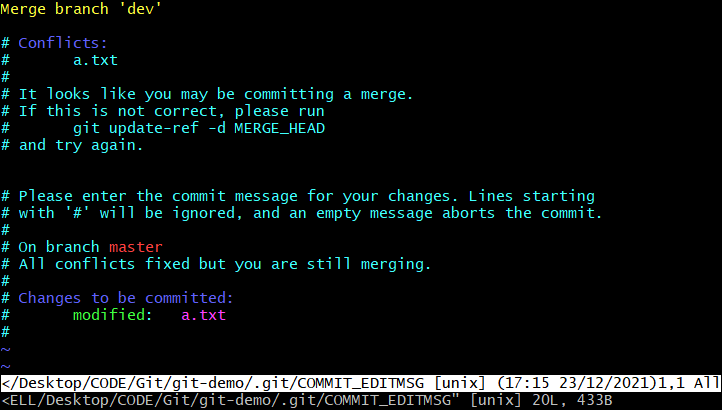

#### git

##### 执行git add file时 .git文件夹里发生了什么

新建file1.txt 添加内容 file2

git add file1.txt

+ 在.git文件夹的objects文件下生成了:

  <!--more-->

  + 08
  + 219db9b0969fa29cf16fd04df4a63964da0b69

说明:08219db9b0969fa29cf16fd04df4a63964da0b69 是由(blob 5\0file1  -> 文件类型 文件长度\0文件内容 )经过hash算法算出来的

保存有文件的内容,类型,尺寸

使用 git  cat-file -t 08219d 查看文件类型   blob

使用 git cat-file -s 08219d 查看文件尺寸    5

使用 git cat-file -p 08219d 查看文件内容   file1

+ .git下生成了index文件

使用git ls-files 可以查看add进索引里的文件

使用git ls-files -s 可以显示更详细的信息(权限 hash值 0 文件名)

+ 修改已经提交的文件(file2.txt) file2 ---> file2.

.git>objects下 生成了新的hash(第一次add file2.txt 生成的hash还在,并没有被覆盖)

+ 提交一个空的文件(文件里面没有内容,也在object里生成hash文件,在index里有此文件)

再次使用 git cat-file -s/-t/-p hash值 查看文件信息| git ls-files -s查看索引区的所有文件详细信息

##### 执行git commit -m''时发生了什么

+ 会在.git/objects下生成两个新的对象(commit对象, tree对象)
+ 查看commit object的类型 git cat-file -t hash值  -----> commit
+ 查看commit object的内容 git cat-file -p hash值
  + tree 78cb5c0858286521651a06a70c08710020565a5a
  + author wuyupei <495174699@qq.com> 1640172659 +0800
  + committer wuyupei <495174699@qq.com> 1640172659 +0800
  + 1commit
  + 可以看出 保存了本次commit的内容

+ 查看tree object的类型git cat-file -t hash值 ----> tree
+ 查看tree object的内容git cat-file -p hash值
  + 100644 blob 08219db9b0969fa29cf16fd04df4a63964da0b69    file1.txt
  + 100644 blob 88a6f2c2238c2d495181417fa1a6838ab230ac91    file2.txt
  + 100644 blob e69de29bb2d1d6434b8b29ae775ad8c2e48c5391    file3.txt
+ .git>logs>refs>head>master
  +  cat .\.git\refs\heads\master  --> d5e4c65621d47c0c10149a7b2ca5630a72cac7ed(commit 对象的hash值)
+ .git>HEAD指向: cat .\.git\HEAD   -----> ref: refs/heads/master----->最新的commit对象

总结:拿到commit节点对象,可以通过git cat-file -p hash 查看内容(tree 对象对应的hash  提交着信息) ---> 在通过git cat-file -p hash查看内容(本次commit各个文件的hash值)----> git cat-file hash -p 查看各个文件的内容

##### HEAD文件

执行当前分支最新的commit

执行cat .git/HEAD  -> ref: refs/heads/master

执行cat .git/refs/heads/master -> d5e4c65621d47c0c10149a7b2ca5630a72cac7ed

执行git cat-file d5e4c -t ---> commit      -p/-s

##### 分支

git branck查看所有分支

git branck dev 创建新分支

git checkout dev 切换到新的分支

利用git cat-file -p|-t|-s等查看信息

删除分支git branch -d|-D 删除分支


#### git对象的压缩

+ git gc
  + 会把所有的object
+ git prune -n
  + 查看执行git prune即将删除的垃圾对象
+ git fsck 查看垃圾对象


+ git verify-pack -v ( git verify-pack pack-b38749bbf5e5f1ad14857d3b3f1c0035d992c9f2.pack -v)
  + 查看压缩进pack里的所有commit tree blob对象

#### 本地仓库推送到远程仓库

打开gitee官网,新建一个**空的**仓库(不初始化仓库,不设置模板,不选择分支模型)点击创建,就会来到一个页面

然后到本地的git文件夹 git remote add origin https://gitee.com/wu-yu-pei/git-demo.git 添加远程仓库

然后在本地提交第一次commit --> 在提交 git push origin master

另外:

+ 可以通过```git remote```查看远程仓库名称
+ 通过```git remote show origin```(会联网)查看远程仓库信息


#### 本地分支和远程分支

通过```git branch```查看本地分支

通过```git branch -a```查看本地分支和远程分支

如果此时在gitee上新建分支本地是看不出来的可以使用```git remote show origin```查看远程仓库的分支,因为此命令会联网


可以执行```git fetch```拉取最新git信息


在执行```git branch -a``就可以看到远程仓库上的分支了

如果在远程仓库删除dev分支

使用```git remote show origin```联网查看远程仓库信息


使用```git branch -a```查看分支信息发现与原来的分支信息一样


为什么呢?因为你没有使用```git fetch```拉去远程仓库的最新git信息

使用```git fetch```拉去信息 此时你会发现,什么也没有输出

在使用```git branch -a```查看所有分支信息发现还是原来的信息

因为git不会引入你执行了git fetch就去把你本地的dev分支删除

你应该执行```git remote prune <banchname>```或者执行```git fetch --prune```来删除你本地遗留的分支


#### 本地分支合并问题

首先```git init```初始化一个git仓库

新建文件a.txt -> a

执行```git add a.txt git commit -m'master 1 commit```

此时master分支上执行了一次commit

场创建dev分支并切换到该分支```git branch dev git checkout dev```或者```git checkout -b dev```

在dev分支上修改a.txt -> + add form dev branch

执行```git add a.txt, git commit -m 'dev 1 commit'```

切换到master分支 查看a.txt的文件,内容是: a 因为上面我们添加内容是在dev分支上的,不会应影响master上的原始文件

现在在master分支修改a.txt ---> + add form master branch

执行```git add a.txt , git commit -m'master 2 commit'```

现在我们需要把dev分支合并到master分支上

```git merge dev```


发现提示信息: Merge conflict in a.txt 意思是 合并出现了冲突在a.txt文件中

此时索引区会存在3个文件分别对应了a.txt的三个版本

使用```git ls-files```查看索引区的内容


使用```git cat-file -p```查看三个文件内容

1:


2:


3:


此时需要合并就需要先解决两个分支的冲突,打开a.txt文件发现git为我们添加了一些标记:

方法一:使用git branch工具的vim编辑器来解决 把对应的内容删掉就可以了 :wq回车保存并退出


方法二:使用vscode来解决冲突


点击第三个框框的按钮就可以了

此时在执行```git add a.txt```把文件添加到索引区

使用```git ls-files```查看索引区文件,此时只有一个最新的a.txt文件

执行```git commit```:



输入:wq退出并保存会看到如下信息:

