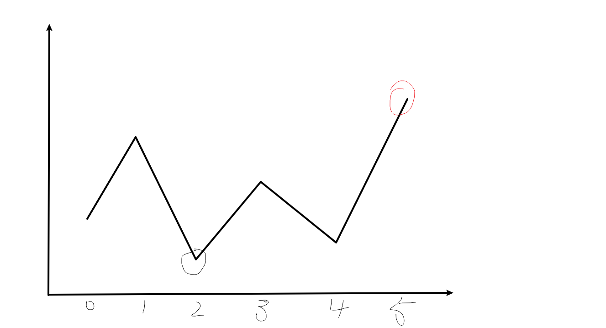

#### [1. 最佳观光组合](https://leetcode-cn.com/problems/best-sightseeing-pair/)

难度中等

给你一个正整数数组 `values`，其中 `values[i]` 表示第 `i` 个观光景点的评分，并且两个景点 `i` 和 `j` 之间的 **距离** 为 `j - i`。

一对景点（`i < j`）组成的观光组合的得分为 `values[i] + values[j] + i - j` ，也就是景点的评分之和 **减去** 它们两者之间的距离。

返回一对观光景点能取得的最高分。

 

**示例 1：**

```
输入：values = [8,1,5,2,6]
输出：11
解释：i = 0, j = 2, values[i] + values[j] + i - j = 8 + 5 + 0 - 2 = 11
```

**示例 2：**

```
输入：values = [1,2]
输出：2
```

 

**思路:**

+ 动态规划
+ 题中已给出公式

**代码:**

```js
/**
 * @param {number[]} values
 * @return {number}
 */
var maxScoreSightseeingPair = function(values) {
    // 初始化最大值为0
    let max = 0;
    for(let i = 0; i < values.length; i++) {
        for(let j = i + 1; j < values.length; j++) {
            // 遍历每一次都求max
            max = Math.max(max, values[i] + values[j] + i - j)
        }
    }
    return max
};
```

#### [2. 买卖股票的最佳时机](https://leetcode-cn.com/problems/best-time-to-buy-and-sell-stock/)

难度简单

给定一个数组 `prices` ，它的第 `i` 个元素 `prices[i]` 表示一支给定股票第 `i` 天的价格。

你只能选择 **某一天** 买入这只股票，并选择在 **未来的某一个不同的日子** 卖出该股票。设计一个算法来计算你所能获取的最大利润。

返回你可以从这笔交易中获取的最大利润。如果你不能获取任何利润，返回 `0` 。

 

**示例 1：**

```
输入：[7,1,5,3,6,4]
输出：5
解释：在第 2 天（股票价格 = 1）的时候买入，在第 5 天（股票价格 = 6）的时候卖出，最大利润 = 6-1 = 5 。
     注意利润不能是 7-1 = 6, 因为卖出价格需要大于买入价格；同时，你不能在买入前卖出股票。
```

**示例 2：**

```
输入：prices = [7,6,4,3,1]
输出：0
解释：在这种情况下, 没有交易完成, 所以最大利润为 0。
```

 **思路:**



+ max记录可获取的最大利润
+ minprice记录最小股票值
+ 遍历数组
+ 跟新最小股票值,更新最大利润

**代码:**

```js
/**
 * @param {number[]} prices
 * @return {number}
 */
var maxProfit = function(prices) {
    // 超出时间限制
    // let max = 0
    // for(let i = 0; i < prices.length; i++) {
    //     for(let j = i + 1; j <= prices.length - 1; j++) {
    //         if(prices[j] - prices[i] > max) {
    //             max = prices[j] - prices[i]
    //         }
    //     }
    // }
    // return max
    
    // 出来了~
    // 两个变量, max--> 最大值  minprice --> 维护一个最小值
    let max = 0, minprice = prices[0]
    for(let i = 0; i < prices.length; i++) {
        // 如果某一个值不最小值还小的话, 就更新最小值
        if(prices[i] < minprice) {
            minprice = prices[i]
        }
        // 否则的话 记录max
        if(prices[i] - minprice > max) {
            max = prices[i] - minprice
        }
    }
    return max

};
```


#### [3. 买卖股票的最佳时机 II](https://leetcode-cn.com/problems/best-time-to-buy-and-sell-stock-ii/)

难度中等1588收藏分享切换为英文接收动态反馈

给定一个数组 `prices` ，其中 `prices[i]` 表示股票第 `i` 天的价格。

在每一天，你可能会决定购买和/或出售股票。你在任何时候 **最多** 只能持有 **一股** 股票。你也可以购买它，然后在 **同一天** 出售。
返回 *你能获得的 **最大** 利润* 。

 

**示例 1:**

```
输入: prices = [7,1,5,3,6,4]
输出: 7
解释: 在第 2 天（股票价格 = 1）的时候买入，在第 3 天（股票价格 = 5）的时候卖出, 这笔交易所能获得利润 = 5-1 = 4 。
     随后，在第 4 天（股票价格 = 3）的时候买入，在第 5 天（股票价格 = 6）的时候卖出, 这笔交易所能获得利润 = 6-3 = 3 。
```

**示例 2:**

```
输入: prices = [1,2,3,4,5]
输出: 4
解释: 在第 1 天（股票价格 = 1）的时候买入，在第 5 天 （股票价格 = 5）的时候卖出, 这笔交易所能获得利润 = 5-1 = 4 。
     注意你不能在第 1 天和第 2 天接连购买股票，之后再将它们卖出。因为这样属于同时参与了多笔交易，你必须在再次购买前出售掉之前的股票。
```

**示例 3:**

```
输入: prices = [7,6,4,3,1]
输出: 0
解释: 在这种情况下, 没有交易完成, 所以最大利润为 0。
```

**思路:**

+ 0
+ 完全没思路
+ 下次再来

**代码:**

```js
/**
 * @param {number[]} prices
 * @return {number}
 */
var maxProfit = function(prices) {

};
```

