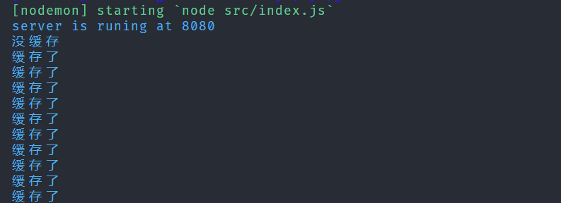

#### Redis

> 学习 redis 的目的 验证码需求 过期需求 登录需求 同意账号多人登录提示

##### 相关命令

```bash
常用命令 String
select 1 选择数据库

get key  获取值

set key value 设置值

exists name 判断是否存在某个key

expire name 10 设置过期事件

FLUSHALL 清楚所有数据库内容

FLUSHDB 清除当前数据库内容

keys * 查看所有的keys

ttl key 看一个数据还有多久过期

move key 1移除当前读key

type key 类型

append key "value" 在key后追加字符串

setLen 获取字符串长度

incr/decr key +-1操作

incrby key 10 一次加10

get/setrange key 0 2 /  0  -1 获取/替换范围字符串

setex set  with expire 设置过期事件

setnx 不存在在设置

常用命令 list
Lpush userlist wuyupei
Rpush userIst liuxu
Lrange 0 -1
Lpop
Rpop
Lindex userlist 0 获取指定位置list的值
Llen userlist 长度
lrem 移除指定的value
rpoplpush 组合命令
```

##### 简单的使用

> nodejs 连接远程服务器上的 redis 进行操作
> 相关代码
> 1.redis 连接

```js
const Redis = require('ioredis');

const redisConfing = {
  port: 6379, // Redis port
  host: '8.141.63.127', // Redis host
  password: '19781209Wyp',
  db: 0, // Defaults to 0
};

module.exports = new Redis(redisConfing);
```

2.简单的缓存操作

```js
const express = require('express');
const redis = require('./redis');

const app = express();

async function checkCache(req, res, next) {
  let result = await redis.get('count');
  if (result) {
    console.log('缓存了');
    redis.incr('count');
    res.send(result);
  } else {
    next();
  }
}

app.get('/user', checkCache, async (req, res) => {
  console.log('没缓存');
  let result = await redis.setex('count', 100, '1');
  res.send(result);
});

app.listen(8080, () => {
  console.log('server is runing at 8080');
});
```

效果:
请求第一次

请求第二次

请求第..次

控制台输出


另外如果相比每次都进行数据库操作,使用 redis 缓存要快的多

#### 总结

> 今天知识入门,简单的使用,后面我还会继续深入学习,争取精通它 加油!
