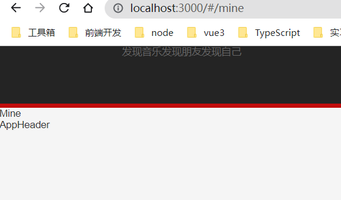

#### vite 搭建 react 开发环境

##### 版本

- react: ^18.0.0,
- react-dom: ^18.0.0,
- react-router-config: ^5.1.1,
- react-router-dom: ^6.3.0,
- styled-components: ^5.3.5
- @types/react: ^18.0.0,
- @types/react-dom: ^18.0.0,
- @vitejs/plugin-react: ^1.3.0,
- vite: ^2.9.2

##### 技术栈

- vite
- react
- hooks
- redux
- react-router
- style-components
- antd

##### 项目文件结构

```shell
│  App.jsx
│  index.jsx
│  tree.txt
│
├─assets
│  ├─css
│  │      reset.css
│  │
│  ├─font
│  └─img
│          download.png
│
├─common
├─components
│  ├─app-fotter
│  │      index.jsx
│  │
│  └─app-header
│          index.jsx
│          style.js
│
├─pages
│  ├─discover
│  │      index.jsx
│  │
│  ├─friend
│  │      index.jsx
│  │
│  └─mine
│          index.jsx
│
├─router
│      index.jsx
│
├─services
├─store
└─utils
```

##### 目录说明

- assets 静态资源
- common 公共文件夹
- components 组件
- page 页面
- router 路由
- services 网络请求
- store 数据管理
- utils 工具函数

##### vite 目前配置

```js
import { defineConfig } from 'vite';
import react from '@vitejs/plugin-react';
import path from 'path';
// https://vitejs.dev/config/
export default defineConfig({
  plugins: [react()],
  resolve: {
    // 配置别名
    alias: {
      '~': path.resolve(__dirname, './'),
      '@': path.resolve(__dirname, 'src'),
      components: path.resolve(__dirname, 'src/components'),
    },
  },
});
```

##### routers/index.jsx

> 使用 hook 的方法创建路由 useRoutes

```js
import { useRoutes } from 'react-router-dom';

import Discover from '@/pages/discover';
import Friend from '@/pages/friend';
import Mine from '@/pages/mine';

const GetRoutes = () => {
  const routes = useRoutes([
    {
      path: '/',
      element: <Discover></Discover>,
    },
    {
      path: '/friend',
      element: <Friend></Friend>,
    },
    {
      path: '/mine',
      element: <Mine></Mine>,
    },
  ]);

  return routes;
};
// 导出的是一个组件,应这样使用 <GetRoutes/>
export default GetRoutes;

// 再路由需要展示的位置使用:
const App = memo(() => {
  return (
    <HashRouter>
      <AppHeader></AppHeader>
      <GetRoutes />
      <AppFotter></AppFotter>
    </HashRouter>
  );
});
```

##### 样式
- reset.css
  [normalize.css](https://github.com/necolas/normalize.css)

- css in js
  > 使用 styled-components写样式

```js
// index.jsx
import React, { memo } from 'react';

import { NavLink } from 'react-router-dom';

import { HeaderWrapper } from './style';

const APPFotter = memo(() => {
  return (
    <HeaderWrapper>
      <div className="content wrap-v1">
        <NavLink to="/">发现音乐</NavLink>
        <NavLink to="/friend">发现朋友</NavLink>
        <NavLink to="/mine">发现自己</NavLink>
      </div>
      <div className="divider"></div>
    </HeaderWrapper>
  );
});

export default APPFotter;

// style.js
import styled from 'styled-components';

export const HeaderWrapper = styled.div`
  height: 75px;
  background-color: #242424;
  color: #fff;

  .content {
    height: 70px;
  }

  .divider {
    height: 5px;
    background-color: #c20c0c;
  }
`;
```
##### 页面基本样式
mine:


friend:


继续加油干!