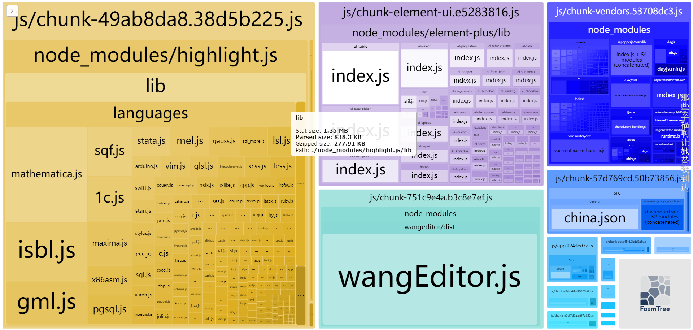
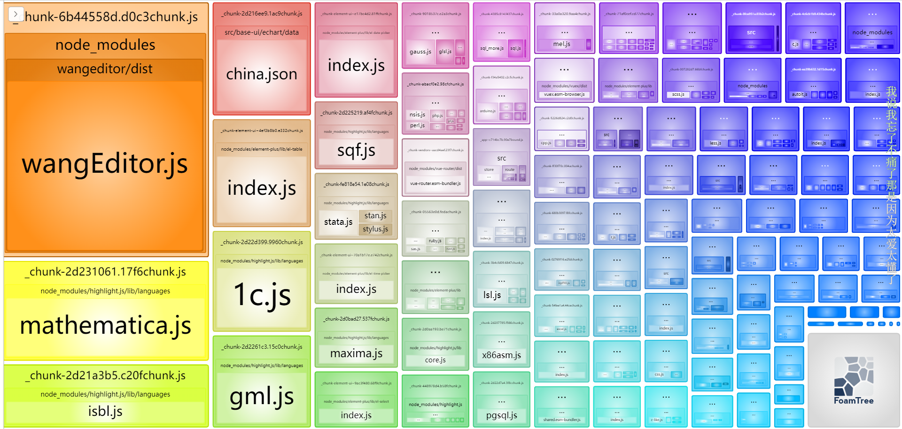
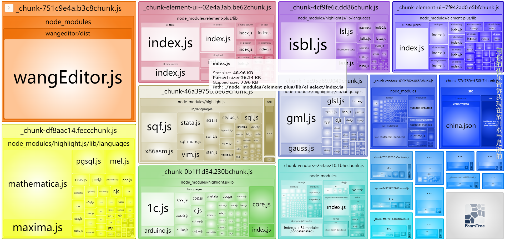

#### vue3-ts 分包

> 上一篇复习了 webpack 的分包,这一篇刚好拿之前的项目实战一下

#### 下面是分包过程中的效果

+ 效果一(有的包太大):



+ 效果二(有的包太小):



+ 效果三(我觉得刚刚好):



---

#### vue.config.js 配置
+ cdn 加载资源
+ webpack-boundle-analyzer 打包依赖分析
+ output hash contenthash basehash
+ splitChunks 分包
+ minSize maxSize
+ cacheGroups(还不是很理解,带深入学习)

```js
// const path = require('path')
const BundleAnalyzerPlugin = require('webpack-bundle-analyzer').BundleAnalyzerPlugin;
module.exports = {
  // publicPath: './',
  configureWebpack: {
    mode: 'production',
    devtool: 'none',
    externals: {
      vue: 'Vue',
      echarts: 'echarts',
      wangEditor: 'wangEditor',
      highlight: 'highlight',
    },
    output: {
      filename: '_[name].[contenthash:4]bound.js',
      chunkFilename: '_[name].[contenthash:4]chunk.js',
    },
    optimization: {
      splitChunks: {
        chunks: 'all',
        // 超过200kb分包
        minSize: 200000,
        maxSize: 200000,
        cacheGroups: {
          elementUI: {
            name: 'chunk-element-ui',
            test: /[\\/]node_modules[\\/]_?element-plus(.*)/,
            chunks: 'all', //all 、async、initial
          },
        },
      },
    },
    resolve: {
      alias: {
        views: '@/views',
      },
    },
    plugins: [new BundleAnalyzerPlugin()],
  },
  devServer: {
    proxy: {
      '^/api': {
        target: 'http://152.136.185.210:5000',
        pathRewrite: {
          '^/api': '',
        },
        changeOrigin: true,
      },
    },
  },
};
```

####总结
通过昨天复习的webpack, 今天进行了一波实战,但是,在配置的过程中有一些配置选项还是很模糊,比如说:cacheGroups配置,hash contenthash chunkhash 区别等,看一遍,配置一遍又忘了,还是配置的不够熟练. 这次打包优化,只是一次简单配置,更深刻的webpack内容还是没有掌握,还是需要
继续学习, 只要学, 就能学到东西, 不学, 就会一直觉得自己什么都会......