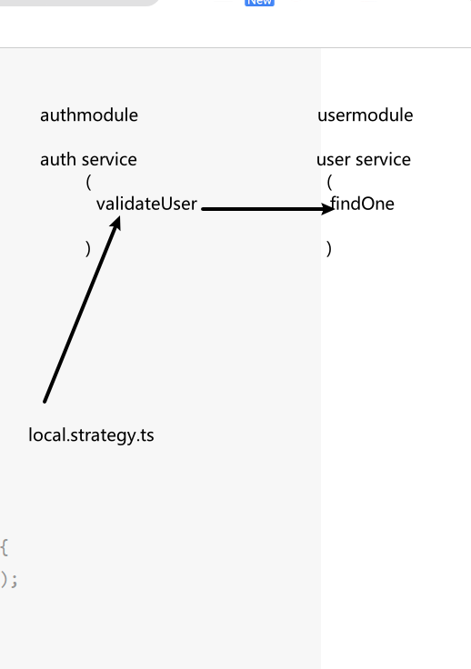

#### 周四

##### 一.算法

680. 验证回文字符串 Ⅱ
     给定一个非空字符串 s，最多删除一个字符。判断是否能成为回文字符串。

示例 1:

输入: s = "aba"
输出: true
示例 2:

输入: s = "abca"
输出: true
解释: 你可以删除 c 字符。
示例 3:

输入: s = "abc"
输出: false

**思路:**
与验证回文字符串思路一样,双指针, 一前一后.
跳过一个数字,是回文字符串 return true

```js
var validPalindrome = function (s) {
  function isValid(left, right) {
    while (left < right) {
      if (s[left] !== s[right]) {
        return false;
      }
      left++;
      right--;
    }
    return true;
  }

  let left = 0;
  let right = s.length - 1;
  while (left < right) {
    if (s[left] !== s[right]) {
      return isValid(left + 1, right) || isValid(left, right - 1);
    }
    left++;
    right--;
  }
  return true;
};

console.log(validPalindrome('abca'));
```

187. 重复的 DNA 序列
     DNA 序列 由一系列核苷酸组成，缩写为 'A', 'C', 'G' 和 'T'.。

例如，"ACGAATTCCG" 是一个 DNA 序列 。
在研究 DNA 时，识别 DNA 中的重复序列非常有用。

给定一个表示 DNA 序列 的字符串 s ，返回所有在 DNA 分子中出现不止一次的 长度为 10 的序列(子字符串)。你可以按 任意顺序 返回答案。

示例 1：

输入：s = "AAAAACCCCCAAAAACCCCCCAAAAAGGGTTT"
输出：["AAAAACCCCC","CCCCCAAAAA"]
示例 2：

输入：s = "AAAAAAAAAAAAA"
输出：["AAAAAAAAAA"]

**思路**
搞一个 map 存结果,一次取 10 个

```js
/**
 * @param {string} s
 * @return {string[]}
 */
var findRepeatedDnaSequences = function (s) {
  // 搞一个map 用来记录个数
  let map = new Map();
  // res用来储存结果
  let res = [];
  for (let i = 0; i <= s.length - 10; i++) {
    // 截取字符串
    let str = s.substr(i, 10);
    // 如果map中有
    if (map.has(str)) {
      // 更新个数
      map.set(str, map.get(str) + 1);
      // 如果个数超过两个就 向res中push结果
      if (map.get(str) === 2) {
        res.push(str);
      }
    } else {
      // 如果没有就设置个数为 1
      map.set(str, 1);
    }
  }
  // 返回结果
  return res;
};
```

##### 二.nest 掘金

> 已完成

代码地址:https://github.com/wu-yu-pei/nest-.git

#### 三.nest 文档

> 已读 next 安全部分

中文地址: https://docs.nestjs.cn/8/security
官网地址: https://docs.nestjs.com/security/authentication


##### 四.nuxt 文档

> 已读

roter 部分 暂时未翻译
